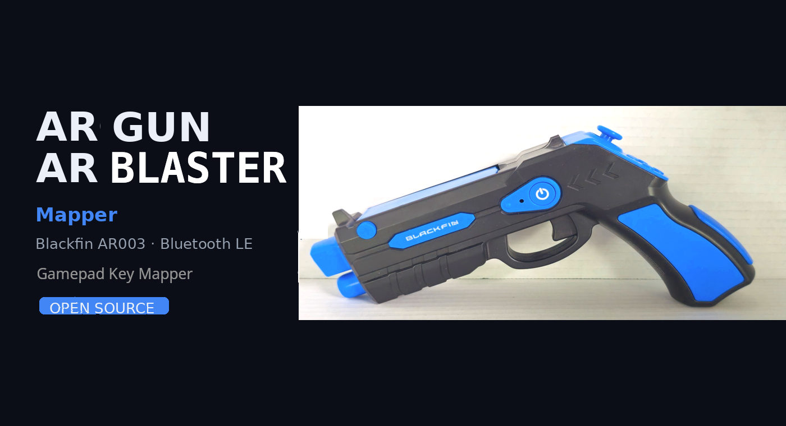
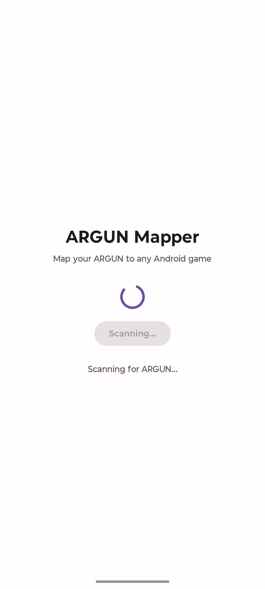
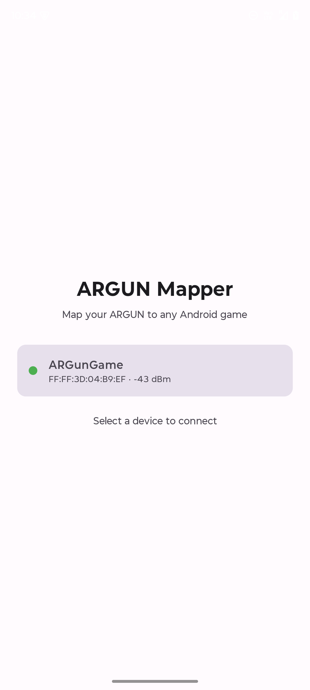
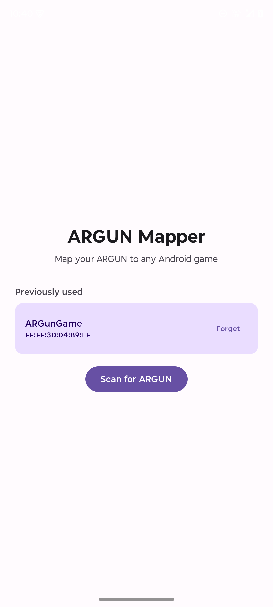

# AR GUN / BLASTER Mapper

[](https://opensource.org/licenses/MIT)
[](https://developer.android.com/about/versions)
[](https://kotlinlang.org)
[](https://developer.android.com/jetpack/compose)



Open-source Privacy Friendly Android app for the **AR GUN** and **AR Blaster** gaming accessory (Blackfin AR003, FCCID `2AMXIAR003`, Other AR Blaster)
that turns it into a Bluetooth gamepad for any Android phone or Android TV.

This is an **open-source alternative to the ARGUN vendor's bundled app** (shipped as
`ARGun2021.apk`, a Unity app published under `com.superchips`). That app is closed
source, works only with its own first-party titles, and does not install on modern
Android. This one speaks the same BLE protocol, adds a full customisable mapping
screen, and runs on current Android phones, Android TV and Fire OS.

> **How buttons reach your games** — Android normally blocks apps from injecting key
> events. There are four routes, and which ones work depends on your device; the app
> detects them and says so plainly. See [Input delivery](#input-delivery-read-this).

## Screenshots

| | |
|---|---|
|  |  |
|  |  |

| | |
|---|---|
| Start — one button to scan | Scanning for a nearby ARGUN |
| A matching device, with signal strength | Remembered devices reconnect without scanning |

## Features

- **BLE scanning & connection** to any device advertising the ARGUN GATT service
- **Live button events** decoded from the vendor's 16-byte notification payloads
- **HID-over-GATT gamepad mode** — no root, no adb, no permissions; the Bluetooth
  stack generates the key events
- **Customisable mapping** — tap any button and choose which Android key it emits
- **Remember & forget devices** — reconnect to a known ARGUN without scanning
- **Persistent mappings** via Room, with one-tap restore of factory defaults
- **Four delivery routes** — root, HOGP, adb/Shizuku-granted permission, or off
- **Auto-detection** that reports what the current device actually supports
- **Foreground service** keeps the connection alive while you play
- **Runs on Android TV / Fire OS** as well as phones and tablets (minSdk 21)
- **No hardcoded MAC address** — works with any AR003 unit in range

## Screenshots
  <table>
  <tr>
    <td align="center"><b>Start screen</b></td>
    <td align="center"><b>Scanning</b></td>
    <td align="center"><b>Device found</b></td>
    <td align="center"><b>Remembered device</b></td>
  </tr>
  <tr>
    <td></td>
    <td></td>
    <td></td>
    <td></td>
  </tr>
</table>

## Requirements

| | |
|---|---|
| Android | 5.0 (API 21) or newer — includes Fire OS 7.x (API 25) |
| Bluetooth | BLE 4.0+ |
| Device | Any Blackfin AR003 ARGUN | Any AR Blaster |
| For input | Root, or a second Bluetooth device for HOGP — see below |

## Building

### One-command build (mxLinux / Ubuntu / Debian / Fedora)

The script installs a **private** JDK and Android SDK under `$HOME` — it does not need
`sudo`, does not touch your system packages, and is safe to re-run.

```bash
chmod +x build-on-mxlinux.sh
./build-on-mxlinux.sh            # build only
./build-on-mxlinux.sh --install  # build, then install over adb
```

The APK lands at `app/build/outputs/apk/debug/app-debug.apk`.

### Building manually

```bash
export JAVA_HOME=/path/to/jdk-17        # a *full* JDK is required (needs `jlink`)
export ANDROID_HOME=$HOME/Android/Sdk
export PATH=$PATH:$ANDROID_HOME/platform-tools

sdkmanager "platform-tools" "platforms;android-35" "build-tools;35.0.0"
yes | sdkmanager --licenses

./gradlew assembleDebug
```

<details>
<summary>Where to get a full JDK</summary>

The build fails with `jlink executable ... does not exist` if only a JRE is installed
(e.g. Debian's `openjdk-21-jre-headless`). Install `openjdk-17-jdk-headless`, or grab a
Temurin tarball and point `JAVA_HOME` at it. `build-on-mxlinux.sh` does this for you.
</details>

### Installing

```bash
adb install -r app/build/outputs/apk/debug/app-debug.apk
```

## Usage

1. Turn on your ARGUN and enable Bluetooth on your device.
2. Open **ARGUN Mapper** and grant the Bluetooth permission when asked.
3. Tap **Scan for ARGUN**. Matching devices appear with a signal-strength dot.
4. Tap a device to connect — a foreground-service notification confirms the connection.
5. On the mapping screen, scroll to **Input delivery** and enable a route
   (**Enable automatically** picks the best one available).
6. If you chose **HOGP**, pair once from your **second** Bluetooth device (PC, TV or
   other phone) with `ARGUN Mapper Gamepad` — not from this one, which cannot see it.
7. Tap a button row to change its key, and **Test** to verify input arrives.
8. Open your game and play.

Connected ARGUNs are remembered. On the next launch they appear under **Previously
used** — tap one to reconnect without scanning, or **Forget** to remove it.

## Button mapping

Factory defaults, measured from a real AR003 rather than taken from the vendor's notes —
the two do not agree. The gun has no marked D-pad and no labelled face buttons: what
looks like a D-pad is a free-moving stick, and four unlabelled buttons sit in a cross
around it.

| Payload | Physical control | Default key | Typical use |
|---------|-------------------|-------------|-------------|
| `ARGun KeyPressed` | Pistol-grip trigger | `KEYCODE_BUTTON_A` | Fire |
| `B5` | Stick up | `KEYCODE_DPAD_UP` | Aim up |
| `B4` | Stick right | `KEYCODE_DPAD_RIGHT` | Strafe right |
| `B7` | Stick down | `KEYCODE_DPAD_DOWN` | Crouch |
| `B6` | Stick left | `KEYCODE_DPAD_LEFT` | Strafe left |
| `B2` | Cross, top | `KEYCODE_BUTTON_Y` | Grenade |
| `B3` | Cross, right | `KEYCODE_BUTTON_B` | Switch weapon |
| `B9` | Cross, bottom | `KEYCODE_BUTTON_X` | Sprint / use |
| `B8` | Cross, left | `KEYCODE_BUTTON_A` | Confirm / jump |

Two motions on the stick produce no payload at all and so cannot be mapped: pushing the
stick straight in, and moving it diagonally. The firmware only reports the four cardinal
directions — a diagonal arrives as nothing at all, and on a fast diagonal push it lands
as whichever cardinal the stick ended nearest.

The A/B/X/Y names are this app's own convention, chosen to match the cross layout above.
The gun itself carries no labels.

Every mapping is editable from the mapping screen and stored locally, so your choices
survive restarts. **Restore Defaults** puts the table above back.

## Input delivery (read this)

Android does not let an ordinary installed app inject key events into other apps.
`injectInputEvent()` needs `android.permission.INJECT_EVENTS`, which is
`signature|privileged` — grantable only to system apps or by an external helper.

**If the ARGUN "connects but buttons do nothing", this is why.** The app decodes every
press correctly either way — what differs is whether anything can *deliver* it. There are
four routes, and which ones work depends on your device and on what else you own:

| Route | Needs | Works on stock, unrooted Android |
|---|---|---|
| **Root** (`su`) | a rooted device | yes, if rooted |
| HOGP (Bluetooth gamepad) | a **second** Bluetooth device | only if you have one |
| adb / Shizuku | a granted `INJECT_EVENTS` | no — see below |
| Disabled | — | in-app display only |

Set the route under **Input delivery** on the mapping screen; the app detects what your
device supports and reports it. **Enable automatically** picks the best available.

> **On a stock, unrooted phone with no second Bluetooth device, none of these can work.**
> That is a platform restriction rather than a gap in this app, and it is worth knowing
> before you spend an evening on it. Rooting the device is the usual answer.

### Route 1 — Root (recommended)

Needs a working `su`, and no Android permission is involved at all. This is the route
that works on a stock-but-rooted Fire TV stick, tablet or phone.

1. Install the app.
2. Open it once so the root manager prompts you, and grant superuser access.
3. On the mapping screen, choose **Root (su)** or tap **Enable automatically**.

The app dispatches via `input motionevent DOWN/UP <code>` on Android 10+, and
`input keyevent <code>` below that. On older releases only `keyevent` exists, which sends
a complete press in one call — so the release event is dropped. Held inputs will feel
different on API 21–28.

Root works, but it is slow: each event forks a `su` process. A fast trigger will outrun
it, so prefer HOGP where it is genuinely available.

### Route 2 — Bluetooth HID gamepad (HOGP)

No root, no adb, no permission of any kind — but it needs a **second** Bluetooth device
to receive the input.

The app turns into a BLE peripheral advertising a HID game pad (service `0x1812`). A
HID host on another device connects, and the Bluetooth stack there generates the key
events itself. The app never injects anything, so there is no permission to check.

Setup:

1. Connect your ARGUN as usual and pick **Bluetooth HID gamepad (HOGP)** under
   **Input delivery**.
2. On your **PC, TV, or second phone**, pair with **`ARGUN Mapper Gamepad`**.
3. Play on that device. It sees a normal gamepad.

**A phone cannot pair with its own gamepad.** Android's Bluetooth settings hides a
peripheral advertised by the same adapter, so `ARGUN Mapper Gamepad` will not appear in
*Pair new device* on the phone running the app, and the connection cannot be made from
inside the app either. This is why HOGP advertises successfully on a handset and then
sits idle forever waiting for a host that can never arrive. If you have no second
Bluetooth device, use Route 1 instead.

Because the ARGUN's stick is reported as *both* a hat switch and ordinary buttons,
games that read either style work without special handling.

### Route 3 — adb

No root needed; works from a computer over USB.

```bash
adb shell pm grant com.argun.mapper android.permission.INJECT_EVENTS
```

Then choose **Permission (adb / Shizuku)** in the app. The permission persists until the
app is uninstalled.

### Route 4 — Shizuku

Install [Shizuku](https://shizuku.rikka.app/), start it (ADB or root), then use Shizuku's
app list to grant `android.permission.INJECT_EVENTS` to ARGUN Mapper. Choose
**Permission (adb / Shizuku)** afterwards.

Note that on Android 9+ Shizuku cannot grant most permissions unless Shizuku itself is
running as root; on Fire OS 7.x (API 25) there are no hidden-API restrictions, so the
ADB-started Shizuku service works reliably there.

### Checking what works

The **Input delivery** card lists exactly what was detected on your device:

```
✓ Root access                    ✓ INJECT_EVENTS granted
✓ Root manager installed         ✗ Shizuku running
```

If nothing is available the app still connects and decodes presses — they simply are not
delivered. Each button row also has a **Test** button, which sends that mapping once so
you can confirm the route works before starting a game.

### Choosing a route

**Enable automatically** picks root when it is available, then HOGP, then an
already-granted `INJECT_EVENTS`. Pick a route by hand if you would rather not use root.

> **Verified so far:** BLE connection and button decoding are confirmed on a real AR003
> (Android 15) — every physical control was identified by capturing its actual payload,
> and the mapping table above is the result. HOGP advertising also starts correctly
> (`adb logcat -s HidPeripheral` logs `Advertising as ARGUN Mapper Gamepad`), but on a
> phone the HID host can never attach, for the reason given in Route 2, so key events
> reaching an actual game remain unverified. The root route is the one to try on a
> rooted device. If a route misbehaves, `adb logcat -s ArgunService HidPeripheral
> InputSimulator` will show whether presses were decoded and where delivery stopped —
> please open an issue with that output.

## Protocol notes

Reverse-engineered from the vendor's GATT dump and an nRF Connect capture.

### Service layout

```
Service  0000fff0-0000-1000-8000-00805f9b34fb   (vendor-specific)
├── fff1  Notify + Read   device status
├── fff2  Read            device id
├── fff3  Notify + Read   button events   <-- the one we use
├── fff4  Read            unknown
└── fff5  Read + Write    control
```

Notifications are enabled by writing `0x0001` to the characteristic's CCCD
(`00002902-0000-1000-8000-00805f9b34fb`).

### Payloads (16 bytes)

| Payload | Meaning |
|---------|---------|
| `"B{N}DOWN"` + NUL padding | Button `B{N}` pressed, `N` in `2`..`9` |
| `"B{N}UP"` + NUL padding | Button `B{N}` released |
| `"ARGun KeyPressed"` | Trigger pressed (also the device handshake) |
| 16 × `0x00` | Trigger released, or idle |

Note the case: the handshake reads `ARGun`, not `ARGUN`.

The trigger is the odd one out — it has no `B{N}` form of its own and reports itself as
the handshake string, which doubles as the device's keepalive. Treating it as a button is
therefore opt-in, under **Input delivery › Trigger (handshake)**, so idle traffic cannot
fire by accident. The `B{N}` numbering does not follow the physical layout; see
[Button mapping](#button-mapping) for the measured correspondence.

### The HID service we expose

For HOGP the app is the GATT *server*, not the client. It advertises:

```
Service  00001812-0000-1000-8000-00805f9b34fb   (Human Interface Device)
├── 2a4a  Read            HID Information (report protocol)
├── 2a4b  Read + Write    HID Control Point
├── 2a4d  Read            Report Map   <- the game pad descriptor
├── 2a4d  Read + Notify   Report       <- 4-byte input reports
└── 2a4e  Read + Write    Protocol Mode
```

Two characteristics share `2a4d`: the spec reuses the UUID for both the Report Map and
the Report itself, distinguished by properties (read-only vs readable + notifiable).

The input report is 4 bytes, no report ID:

```
byte 0   bits 0..3  stick hat switch, 0=N .. 6=W, 8=no direction
byte 1   bits 0..7  buttons, B2 -> bit 0 .. B9 -> bit 7
byte 2   unused
byte 3   unused
```

The stick is deliberately reported **twice** — once as a hat switch and once as ordinary
buttons — so games that read either style work unmodified.

## Project layout

```
app/src/main/java/com/argun/mapper/
├── ArgunMapperApp.kt          Application class
├── ArgunService.kt            Foreground service; owns the BLE connection
├── ble/
│   ├── BleManager.kt          Scan, connect, GATT callbacks, payload parsing
│   ├── HidPeripheral.kt       HOGP: advertises the HID service, feeds button reports
│   ├── HidReport.kt           HID report map + input report packing
│   ├── ConnectionState.kt     Sealed connection state
│   └── NotificationHelper.kt  CCCD descriptor encoding
├── input/                     Key event delivery
│   ├── InputSimulator.kt         Routes events to the selected strategy
│   ├── InjectionStrategy.kt      Strategy interface + InjectionMode
│   ├── RootInjectionStrategy.kt  `su` + `input` (no permission needed)
│   ├── PermissionInjectionStrategy.kt  InputManager, needs INJECT_EVENTS
│   └── PrivilegeDetector.kt      Detects root / Shizuku / granted permission
├── model/                     ArgunButton, ArgunDevice, KeyMapping, Notification
├── data/                      Room entity, DAO, database, repository
└── ui/                        Compose screens + MainViewModel
```

## Architecture

- **MVVM** — `MainViewModel` exposes a single immutable `MainUiState` via `StateFlow`
- **Jetpack Compose** + Material 3, dark/light themes
- **Room** for mappings, **Coroutines/Flow** for BLE events
- **Foreground service** (`connectedDevice` type) so the link survives backgrounding
- **Strategy pattern** for input delivery, so root/permission/off are interchangeable
- **minSdk 21** for Fire OS and older Android TV hardware

## Contributing

Issues and pull requests are welcome. Since the project is aimed at the ARGUN community,
please keep it lightweight and dependency-light.

## Acknowledgements

- Blackfin Co. for the ARGUN gaming accessory
- The Android Bluetooth LE community
- Everyone contributing mappings and fixes

## License

[MIT](LICENSE)
